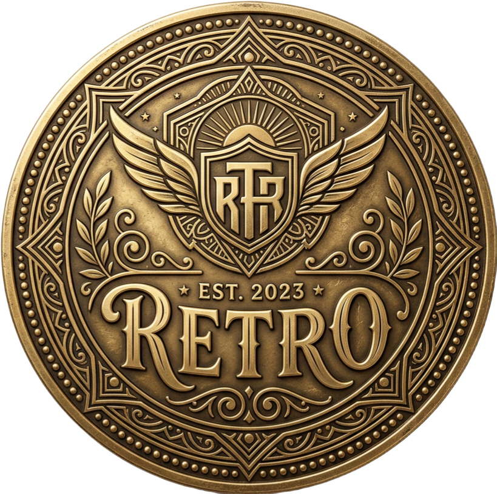

<br/>
<p align="center">
  <a href="https://github.com/Jafar777/retro">
    
  </a>

  <p align="center">
   <strong>RETRO COIN</strong> - The Solana Gaming Revolution
    <br/>
    <br/>
    <a href="https://retro-coin.vercel.app/">View Live Site</a>
    .
    <a href="https://github.com/Jafar777/retro/issues">Report Bug</a>
    .
    <a href="https://github.com/Jafar777/retro/issues">Request Feature</a>
  </p>
</p>

## 🕹️ About The Project

Retro Coin is a community-driven Solana token with an integrated retro gaming ecosystem. Built with an authentic 80s arcade aesthetic, the project combines the nostalgia of classic 8-bit games with modern DeFi utilities.

### Features

- 🎮 **Play-to-Earn Gaming** - Earn $RETRO by playing retro games
- 🚀 **Lightning Fast** - Built on Solana for instant, feeless transactions
- 🏆 **Gaming Rewards** - 5% of every transaction rewards gamers
- 💎 **Deflationary** - Limited supply of 690,000,000 tokens

## 🎮 Games

### Flappy Bird
Navigate through pipes and see how far you can go! The first game in our ecosystem.


## 📊 Tokenomics

| Allocation | Percentage |
|------------|------------|
| Total Supply | 690,000,000 |
| Game Rewards | 5% |
| Auto LP | 3% |
| Marketing | 2% |

## 🛠️ Built With

- **Next.js** - React framework
- **TypeScript** - Type-safe development
- **Tailwind CSS** - Utility-first styling
- **Framer Motion** - Animations
- **Solana** - Blockchain infrastructure

## 🚀 Quick Start

```bash
# Install dependencies
npm install

# Run development server
npm run dev

# Build for production
npm run build
```

## 📁 Project Structure

```
retro-main/
├── pages/
│   ├── index.tsx      # Homepage with Retro Coin branding
│   └── game.tsx       # Flappy Bird game page
├── components/
│   ├── Game.tsx       # Main game component
│   ├── FlappyBird.tsx # Bird sprite and physics
│   ├── Pipes.tsx      # Obstacle generation
│   ├── Background.tsx # Game background
│   └── Footer.tsx     # Score display
├── hooks/             # Custom React hooks
└── public/            # Static assets
```

## 🌐 Connect With Us

- 🐦 Twitter: [@RetroCoinSOL](https://twitter.com/RetroCoinSOL)
- 💬 Telegram: [Join Community](https://t.me/retrocoinsol)
- 📺 Discord: [Join Server](https://discord.gg/retrocoin)

---

<p align="center">
  Built with 💛 by the Retro Coin Community
  <br/>
  © 2024 Retro Coin • Built on Solana • Powered by Community
</p>
